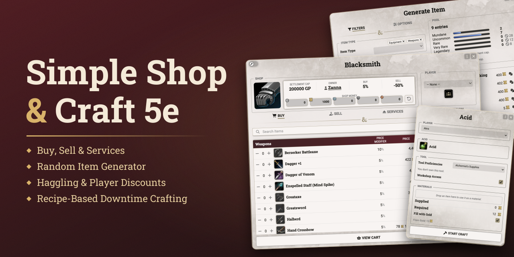
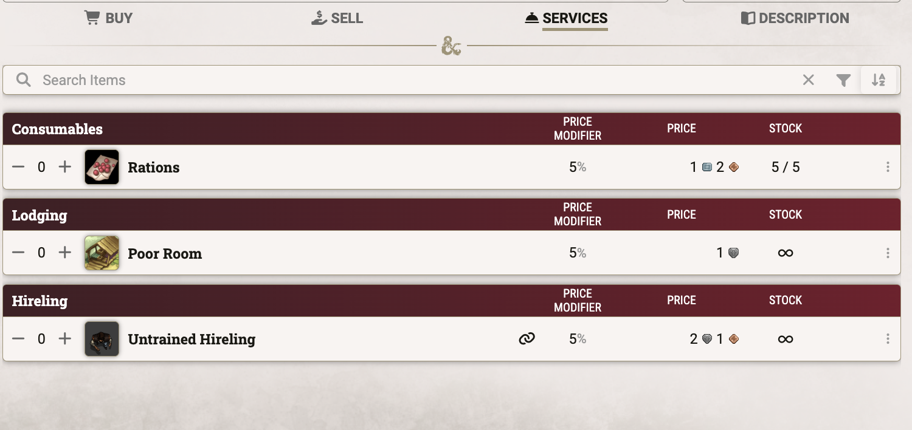
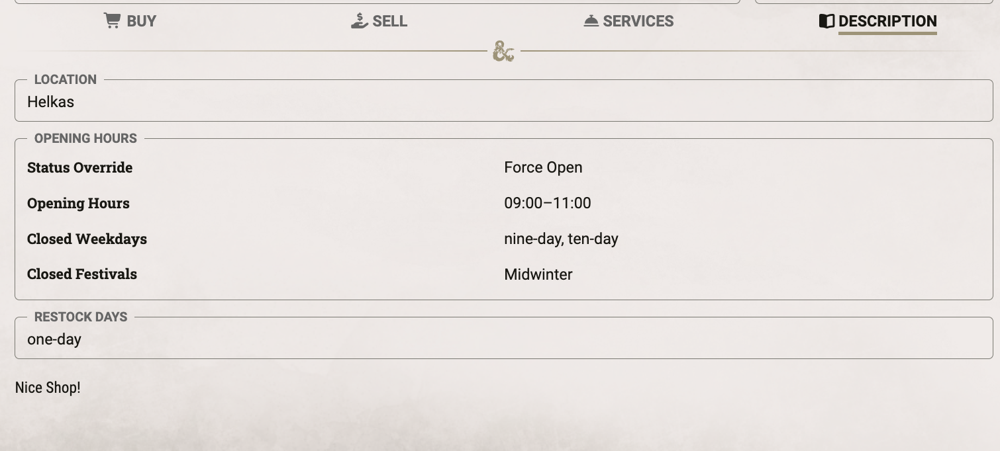
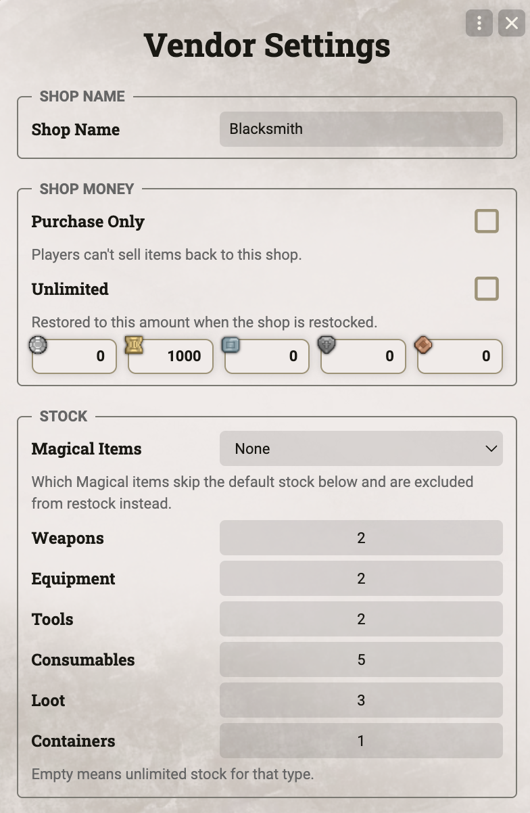

**Simple Shop & Craft 5e** adds shops and downtime crafting to the dnd5e system.

The GM sets up shops with their own stock, prices, and opening hours. Shops restock on their own as days
pass in the world calendar. Players buy and sell, haggle with the shopkeeper, and craft items from recipes
the GM provides.

Every purchase, sale, and craft order goes to the GM as a chat card and only takes effect once approved.

## Contents

- [Getting Started](#getting-started)
- [Shops](#shops)
- [Prices & Haggling](#prices--haggling)
- [Random Item Generator](#random-item-generator)
- [Crafting](#crafting)
- [Settings](#settings)
- [Credits & License](#credits--license)

---

## Getting Started

Open the **Shop & Craft** window with its button at the top of the Items sidebar. The GM builds shops and
recipes here, and players come here to browse the shops and recipes available to them.

A new shop needs only a name. Pick a Starter Pack to fill its shelves right away with the stock of a
Blacksmith, Alchemist, Tavern, General Store, Magic Shop, or Blackmarket. Every new shop starts out
Inactive and stays hidden from players until the GM opens it for business.

---

## Shops

### Shop Manager

The Shops tab lists every shop with its owner, opening hours, Settlement Cap, and status.

- **Active and Inactive.** Shops sit in separate groups, and players only ever see the Active ones.
- **Shop actions.** Right-click a shop to toggle it Active, open its Vendor Settings, duplicate it, or
  delete it.
- **Show to All Players.** Opens the shop on every connected screen at once, for the moment the party steps
  through the door.

<table>
  <tr>
    <td colspan="2">
      <strong>Shop Manager</strong> 
      
    </td>
  </tr>
</table>

### Shop Sheet

Each shop opens in its own sheet with four tabs. The header shows the shop's owner, Settlement Cap, Buy and
Sell modifiers, and the coin in its till.

- **Buy.** The GM adds items from the Compendium Browser, by UUID, or by dragging them in. Fill from Table
  draws stock from a RollTable, and Generate Item rolls up new wares (see
  [Random Item Generator](#random-item-generator)).
- **Sell.** Lists the items of the buying character. Items bought as a bundle, such as arrows, are sold back
  one piece at a time.
- **Services.** Holds Lodging and Hirelings, along with any Buy item marked as a Service. A service costs
  coin but hands over no item.
- **Description.** The shop's location, opening hours, restock days, and a description of the place.
  Outside its opening hours players can't enter the shop, unless the GM forces it open.
- **Who buys.** Players shop with their own character or with the Party actor.
- **Checkout.** Purchases and sales gather in a cart. On confirmation the order goes to the GM as a chat
  card, and items and coin change hands once the GM accepts.
- **Stacking.** An item the character already owns gains quantity instead of arriving as a copy. Containers
  are the exception.

<table>
  <tr>
    <td width="60%">
      <strong>Buy tab</strong> 
      
    </td>
    <td width="40%">
      <strong>Cart and GM confirmation</strong> 
       
      
    </td>
  </tr>
</table>
<table>
  <tr>
    <td width="50%">
      <strong>Services tab</strong> 
      
    </td>
    <td width="50%">
      <strong>Description tab</strong> 
      
    </td>
  </tr>
</table>

### Stock & Restock

Vendor Settings hold the shop's name, its money, and the default stock for new items.

- **Stock modes.** Each item has Normal Stock, Unlimited Stock, or Exclude from Stock. Excluded items keep
  their count but never restock, for the one-of-a-kind piece.
- **Default stock.** New items start with a max stock set per item type. The Magical Items rule decides
  which magic items skip that default and start excluded instead. Any item can still set its own stock.
- **Shop money.** The till has a Current and a Max amount, or is Unlimited. Purchases by players can push
  Current past Max. With Purchase Only, the shop buys nothing from players.
- **Restock.** Reset Stock & Shop Money refills every Normal item and returns the till to Max. On the chosen
  Restock Days this happens on its own at the next in-game day change, which also lifts failed haggling
  locks. This needs a calendar source (see [Settings](#settings)).

<table>
  <tr>
    <td>
      <strong>Vendor Settings</strong> 
      
    </td>
  </tr>
</table>

---

## Prices & Haggling

### Price Modifiers

Every price starts from the item's own value and passes through the shop's modifiers. A tooltip on each price
shows which modifiers applied.

- **Shop modifiers.** A Buy and a Sell modifier apply to every trade, by default +0% and −50%.
- **Item overrides.** The GM can give a single item its own price, or its own modifier in place of the
  shop's.
- **Fixed-Value items.** Gemstones and art objects keep their full value, bought or sold. The list of loot
  types is set per shop.
- **Crafter.** A character with the Crafter feat pays 20% less for nonmagical items.
- **Settlement Cap.** A village, town, or city only deals in items up to 20, 2,000, or 200,000 GP, or up to a
  custom cap. Pricier items stay hidden from players, and the cap can apply to selling as well.

<table>
  <tr>
    <td width="30%">
      <strong>Price modifier breakdown</strong> 
      
    </td>
  </tr>
</table>

### Player Discounts & Haggling

The GM can grant single players their own deal, and players can try to haggle the price down.

- **Player discounts.** Drop an actor into the Players dialog and give it its own Buy and Sell modifier. It
  adds to the shop's modifier.
- **Haggling.** The player rolls a Charisma skill against a DC equal to the shopkeeper's Intelligence score,
  minimum 15. A Friendly shopkeeper grants Advantage, a Hostile one Disadvantage.
- **Result.** The roll sets no discount on its own. The GM decides what a success is worth and enters it as
  a player discount.
- **Cooldown.** After a failed roll, that skill can't be tried again at this shop for 24 hours. The lock lifts
  at the next in-game day change, or the GM resets it in the Players dialog.

<table>
  <tr>
    <td width="50%">
      <strong>Haggle dialog</strong> 
      
    </td>
    <td width="50%">
      <strong>Player discounts</strong> 
      
    </td>
  </tr>
</table>

---

## Random Item Generator

Generate Item rolls up new stock for a shop. The GM reviews every result before it goes on the shelf.

- **Filters.** Combine item types, each with its own subtypes and base items, and narrow the roll by rarity
  and magic.
- **Genuine magic items.** Enchantment templates become the real thing, so a "+1 Weapon" rolled for a Dagger
  arrives as a true +1 Dagger.
- **Spell Scrolls.** Each scroll carries a real spell, filtered by school, class, level, or rituals.
- **Enspelled Items.** Enspelled Staffs, Weapons, and Armor come bound to a random spell of the level their
  rarity allows.
- **Weighting.** Sets how often enchanted items come up: per Combination, Variant, or Template.
- **Pool.** Shows how many entries each rarity holds, and how many the Settlement Cap or the shop's current
  stock leave out.
- **Results.** Up to ten items per roll. Reroll or remove single results, then add the rest to the shop.

<table>
  <tr>
    <td width="100%">
      <strong>Generate Item dialog</strong> 
      
    </td>
  </tr>
</table>

---

## Crafting

### Recipes

The Craft tab lists every recipe by the type of item it makes, with its material value, duration, and
required proficiencies. Click a recipe to start crafting it. The GM writes recipes in the Recipe Editor.

- **Target item.** The item a recipe makes and how many per craft. Cost and duration follow the item's
  crafting value, or the GM sets a custom duration. A recipe can also skip the crafting value and rely on its
  materials alone.
- **Materials.** Each material is a fixed item or a rule, such as any gemstone worth 50 GP. The materials
  only need to reach the recipe's total value, unless the GM marks one as Required. With Freeform Materials,
  players may offer any item of enough value.
- **Proficiencies.** Tools and skills combine by Proficiency Mode: Tool & Skill, Tool or Skill, or Every
  Listed Tool & Skill. With Workshop Override, a character can work in a proper workshop instead of owning
  the tool.
- **Unlock.** A recipe is open to listed actors only, to everyone, or to every character proficient with its
  tool.
- **Spell Scrolls.** With a Spell Scroll as its target, the crafter picks a spell of the recipe's level, from
  their prepared or known spells or from any compendium.
- **Sharing.** Export recipes to JSON and import them into another world.

<table>
  <tr>
    <td width="40%">
      <strong>Recipe editor</strong> 
      
    </td>
    <td width="60%">
      <strong>Recipe list</strong> 
      
    </td>
  </tr>
</table>

### Crafting an Item

A player starts a craft from the Craft tab. Once the GM approves, the work goes on through the character's
downtime.

- **Start Craft.** Choose the character and tool, then add owned materials. Any value still missing can be
  paid in gold. For a Spell Scroll, pick the spell and set its save DC and attack bonus, which default to
  the crafter's own.
- **Approval.** The order goes to the GM as a chat card. On acceptance, materials and gold are spent and an
  in-progress item appears in the character's inventory.
- **Working.** Use the Progress Craft activity of the in-progress item and enter the hours to work. A
  character works up to 8 hours a day by default, and the count resets on a Long Rest. Each session posts
  its progress to chat.
- **Calendar time.** With a calendar source active, a session runs as in-game time passes. It completes on its
  own once the planned hours are done, or the GM ends it early and credits the time spent.
- **Completion.** When the work is done, the in-progress item becomes the finished item. If the character
  already owns one, it stacks.

<table>
  <tr>
    <td width="50%">
      <strong>Start Craft dialog</strong> 
      
    </td>
    <td width="50%">
      <strong>Craft confirmation</strong> 
      
    </td>
  </tr>
  <tr>
    <td colspan="2">
      <strong>Crafting progress</strong> 
      
    </td>
  </tr>
</table>

---

## Settings

Two menus in the module settings hold world-wide options.

- **Configure Defaults.** The Buy and Sell modifiers, shop money, Magical Items rule, and default stock per
  item type that every new shop starts with.
- **Configure Homebrew.** Max Hours per Workday for crafting, 8 by default, and the Calendar Mode.
- **Calendar Mode.** Restock days, haggling cooldowns, and crafting sessions can follow Foundry's world
  calendar. Calendar Mode turns on by itself when a world clearly keeps its calendar in use: Calendaria or
  Ember is active, or dnd5e's Daily Recovery Mode is set to Calendar Recovery. Set it to Always On or Always
  Off to decide by hand.

---

## Credits & License

- **License.** Released under the [MIT License](LICENSE).
- **Font.** The banner uses [Roboto Slab](https://fonts.google.com/specimen/Roboto+Slab) under the Apache
  License 2.0.
