# Simple Shop & Craft 5e

**Simple Shop & Craft 5e** brings the shop and the workshop to the table. GMs stock the shelves and write
the recipes; players buy, sell, haggle, and craft straight from their own character sheet.

> No coin changes hands and no craft begins without the GM's word — every purchase, sale, and craft order
> goes out as a confirmation chat card first.

## Highlights

- **Stand up as many shops as a campaign needs.** Each one keeps its own buy/sell modifiers, Settlement Cap,
  and money pool; stock it by item identifier or a direct UUID, then let players buy and sell straight from
  their own character sheet — restocking, price overrides, and per-item caps are one click away for the GM.
- **Roll up magic items that are the real deal.** Filter by type, subtype, and Rarity, and the generator
  doesn't hand back a placeholder — a "+1 Dagger" comes out as a genuine enchanted Dagger, and a Spell
  Scroll arrives with its actual spell already inscribed.
- **Every search runs through the Compendium Browser.** Lookups resolve by identifier against whatever
  sources a GM has enabled there, so a shop's stock keeps working even as compendiums get added, swapped,
  or retired.
- **Haggling and per-player deals.** A skill check against the shopkeeper's attitude shaves a temporary
  discount off the shop's prices on a success; GMs can also set a fixed buy/sell discount for an individual
  player, which stacks additively on top of the shop's own modifier.
- **Full Downtime Crafting, per the 2024 PHB/DMG rules.** GMs write the recipe — target item, materials,
  tool, duration — players supply the goods and put in the workdays; progress lives on a real in-progress
  item, and the finished piece appears the moment the clock runs out.

---

## Shops & Trading

The "Shop & Craft" window is where a GM builds out a campaign's shops, and where players go to open one
for themselves.

- **Creating a shop** starts from a short prompt: give it a name, and optionally pick a Starter Pack — a
  ready-made set of stock for a common shop type (Blacksmith, Alchemist, Tavern, General Store, Magic Shop,
  Blackmarket) — to skip populating it item by item.
- **Active and Inactive** shops are split into their own sections. An Inactive shop stays invisible to
  players — it simply doesn't appear in their list — while the GM keeps full access to finish setting it
  up. Toggle it Active once it's ready for business.
- **Show to All Players** pushes a shop open on every connected client immediately, bypassing the list
  entirely — useful for putting a shop in front of the party the moment it matters, without asking them to
  go find it themselves.
- GMs can duplicate or delete a shop directly from the list.

<table>
  <tr>
    <td colspan="2">
      <strong>Shop Manager</strong> 
      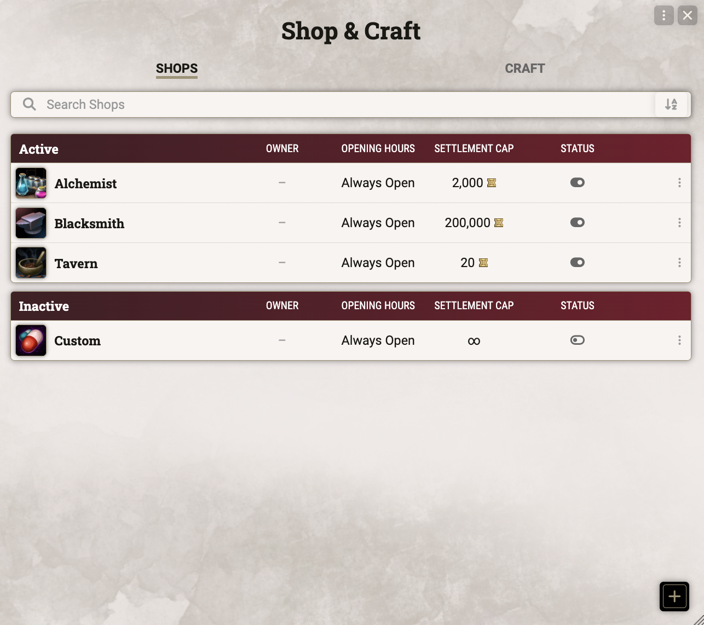
    </td>
  </tr>
</table>

### Buy & Sell

- The Buy and Sell tabs list every item's price, weight, and stock; each line has its own +/- stepper for
  adding it to the cart.
- Adding items pulls from the Compendium Browser and stores them by identifier — resolved against whichever
  pack matches the world's D&D rules version, so on a modern (2024) table that means PHB/DMG content, with
  matching SRD (2014) entries skipped. Dragging an item in instead stores it by UUID, for one-off pieces
  with no matching compendium entry.
- Buying an item the character already owns (matched by identifier) increases its quantity instead of
  creating a duplicate — containers are the exception, since each one holds its own separate contents.
- Items sold as a bundle — ammunition and other stackable gear — are bought as a set, but a player selling
  one back to the shop always sells a single piece; the price is divided down to match.
- Stock is tracked per item, with a manual Restock button that refills everything back to its configured
  maximum (calendar-based auto-restock is planned).
- The Settlement Cap enforces the DMG 2024 guidance on the priciest single item a settlement's size can
  support — anything above it is hidden from players and flagged for the GM.
- The shop's money pool has a Current and a Max value. Current can run past Max as sales come in; hitting
  Restock caps it back down to Max.
- The header shows an Icon, a Vendor (a linked NPC), and the Buy/Sell modifiers at a glance; a Description
  tab covers the shop's Location and free-text description.
- Every purchase or sale goes out as a chat card for GM confirmation — accepting it writes or removes the
  items and adjusts currency immediately.
- Final prices always round down to the nearest copper piece.
- Platinum is left out of every price and pool display by default — the breakdown caps at the world's own
  default currency — but its value still folds correctly into the underlying copper math wherever it matters.

<table>
  <tr>
    <td colspan="2">
      <strong>Shop sheet</strong> 
      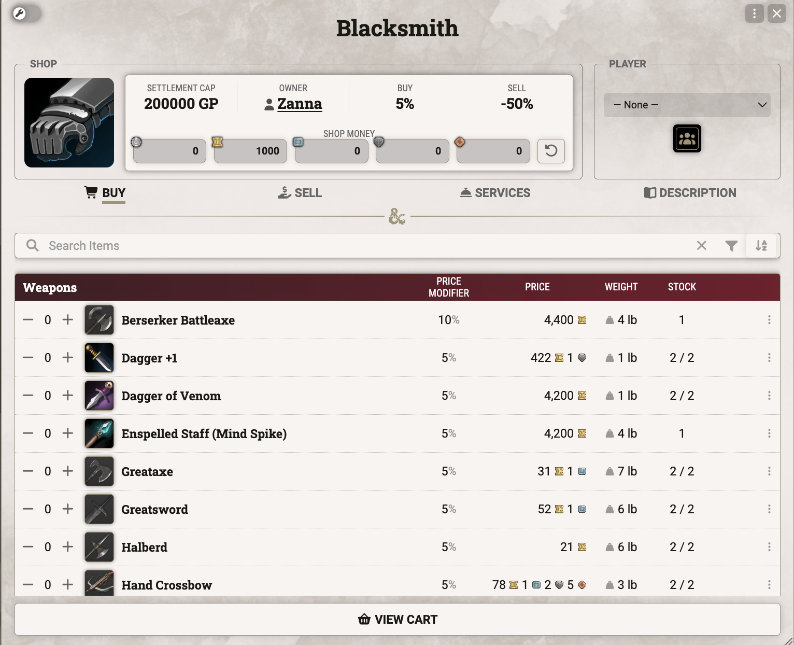
    </td>
  </tr>
  <tr>
    <td width="60%">
      <strong>Shopping cart</strong> 
      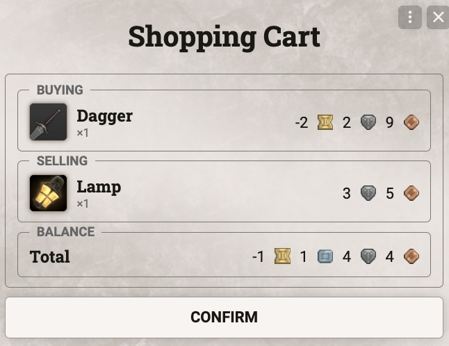
    </td>
    <td width="40%">
      <strong>Purchase confirmation</strong> 
      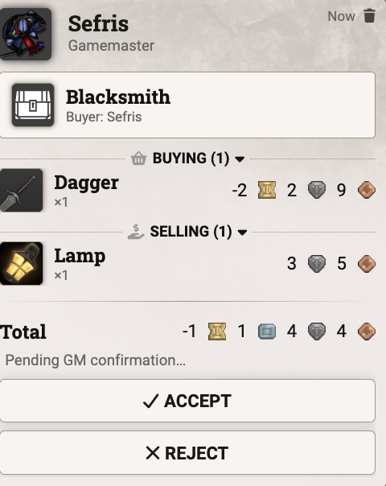
    </td>
  </tr>
</table>

### Magic Item Generator

- Filters stack per submission: pick one or more item types (Weapon, Equipment, Consumable, …), each with
  its own subtype filter — e.g. "Weapons: Martial only" and "Equipment: Wondrous only" combine into a
  single roll. A Rarity filter and a Magic/Mundane toggle apply across every selected type, and a count
  slider rolls up to ten items at once.
- Selecting the Scroll subtype under Consumables unlocks spell filters — school, class (drawn from the same
  registered spell lists the Compendium Browser uses), level, and ritual-only — and each scroll is drawn
  straight from a matching spell, not just a random scroll shell.
- The underlying search runs through the Compendium Browser, matched by identifier, the same way Buy tab
  entries are.
- Enchant templates resolve into the genuine item they describe: rolling a "+1, +2, or +3 Weapon" template
  against a Dagger produces an actual "+1 Dagger", built by pairing a real base item with the
  enchantment's effect.
- Price comes from whichever the enchantment effect itself defines first; failing that, from the enchant
  item's own listed price; and only as a last resort from the same rarity-based default table used
  elsewhere in the shop.
- A purchased Spell Scroll gets its identifier rewritten to include its level and the spell it carries, so
  two different scrolls never collide or get treated as the same item.
- Rolled items shown in the Buy tab that don't already exist as their own compendium document —
  synthesized enchant results, scrolls tied to a spell — are placeholders assembled purely for display.
  They aren't a real item yet, so their sheet can't be edited, and only become one once the purchase goes
  through.
- Ammunition without its own listed price defaults to a tenth of its rarity's consumable value per piece,
  per the DMG 2024 guidance that ten pieces equal one potion of the same rarity.

<table>
  <tr>
    <td width="100%">
      <strong>Generate Item dialog</strong> 
      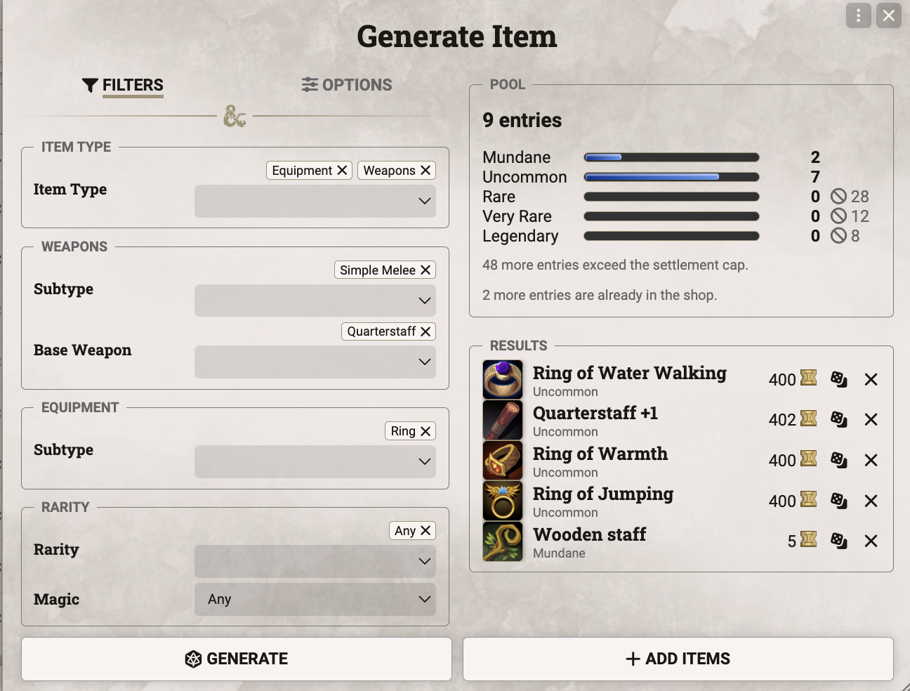
    </td>
  </tr>
</table>

### Discounts & Haggling

- The shop's own Buy and Sell modifiers apply to every purchase and sale by default (0% and -50%).
- Beyond that shop-wide rate, any single item can carry its own price override and its own discount
  override, layered on top.
- Per-player discounts live in their own dialog: drag an actor in, then set a buy/sell percentage for them
  by hand — nothing here is computed automatically.
- Haggling opens a roll dialog for a Charisma skill against a DC set by the shop NPC — the NPC's
  Intelligence score, floored at 15, per the rules. The NPC's attitude toward the party grants advantage
  (Friendly) or disadvantage (Hostile), also per the rules.
- The roll itself never touches the shop's percentages — there's no official formula for how big a haggled
  discount should be, so the GM decides and applies it by hand through the Player Discounts dialog.
- A failed haggle locks that player out of trying again with this shop. RAW that lock lasts 24 hours, but
  there's no in-module timer yet — a GM currently has to clear it by hand from the Player Discounts dialog;
  a calendar-based automatic reset is planned.

<table>
  <tr>
    <td width="40%">
      <strong>Haggle dialog</strong> 
      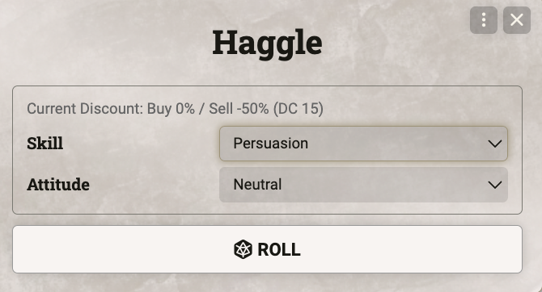
    </td>
    <td width="40%">
      <strong>Player discounts</strong> 
      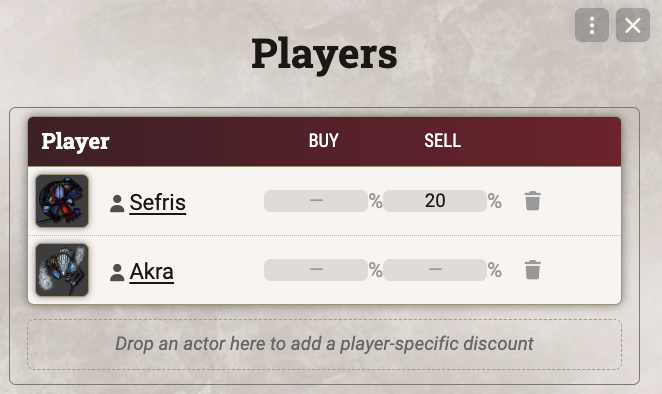
    </td>
    <td width="20%">
      <strong>Price modifier breakdown</strong> 
      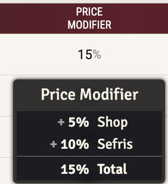
    </td>
  </tr>
</table>

---

## Crafting

### Creating Recipes

- The Craft tab lists every recipe grouped by its target item's type, so players can see at a glance what's
  available to make.
- A recipe can be open to every player, or locked down to a specific list of actors.
- Building one starts with a target item — required — picked from the Compendium Browser or dropped in
  directly by UUID.
- From there a GM sets the material value threshold, the fixed materials list, whether freeform substitutes
  are allowed, the required tool proficiency, and a duration. Price and duration default to the target
  item's rules-based cost — with the DMG's own exceptions for Spell Scrolls (cost by spell level) and the
  Potion of Healing (1 day / 25 GP) used instead of the generic rarity formula.
- Fixed materials aren't individually mandatory — what counts is total value. A player only needs to supply
  enough of the listed (or freeform, if allowed) materials to clear the threshold, not every single one.
- New materials are added the same way as the target item: a + button pulls from the Compendium Browser,
  matched by identifier; dragging one in instead stores it by UUID.

<table>
  <tr>
    <td width="40%">
      <strong>Recipe editor</strong> 
      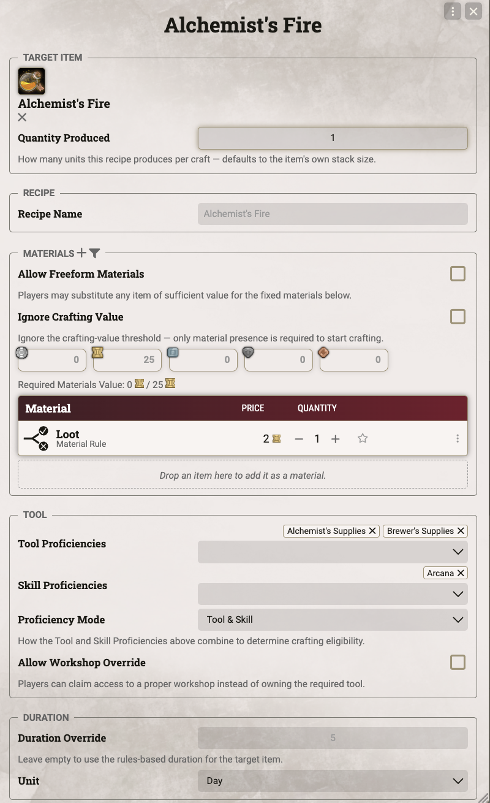
    </td>
    <td width="60%">
      <strong>Recipe list</strong> 
      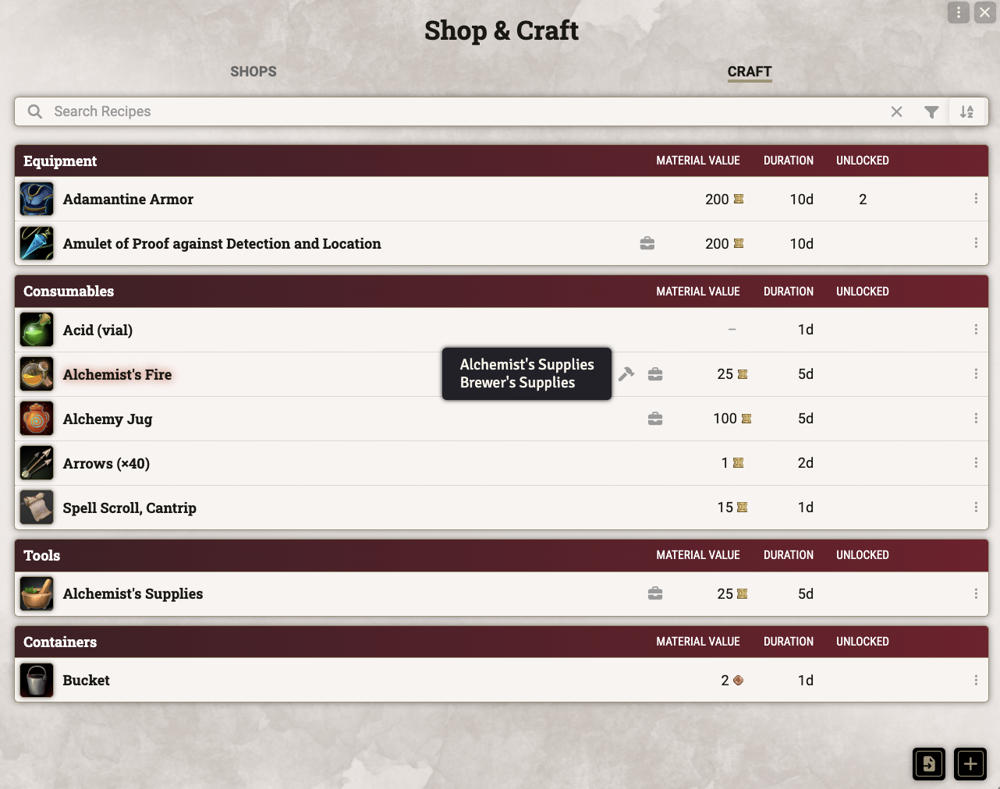
    </td>
  </tr>
</table>

### Crafting an Item

- Starting a craft opens a player-facing dialog: pick the tool (if the recipe allows more than one), choose
  which owned materials to contribute, and optionally fill any remaining value gap with gold.
- Starting it sends a chat card that needs GM confirmation before anything is consumed.
- Once confirmed, the materials and gold are spent and an in-progress craft item spawns directly in the
  character's inventory.
- Clicking the item's activity advances progress by one workday — the smallest unit of crafting time under
  the rules — once per Long Rest.
- If that activity ever gets deleted by accident, it's recreated automatically the next time the sheet
  renders; the in-progress item itself is not.
- Once progress reaches the full duration, the in-progress item is replaced by the real target item.
- If the character already owns an item with the same identifier, the finished item stacks onto it instead
  of creating a duplicate.

<table>
  <tr>
    <td width="50%">
      <strong>Start Craft dialog</strong> 
      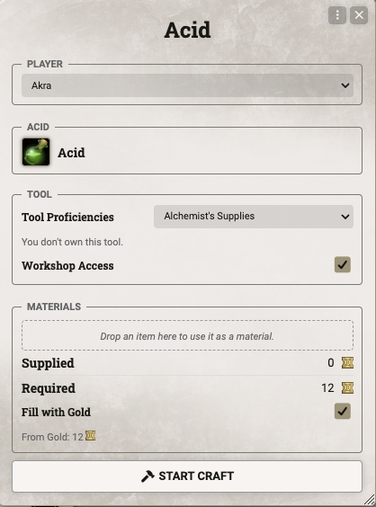
    </td>
    <td width="50%">
      <strong>Craft confirmation</strong> 
      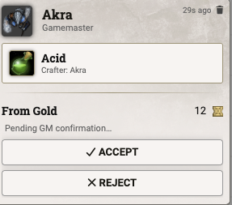
    </td>
  </tr>
  <tr>
    <td colspan="2">
      <strong>In-progress craft item</strong> 
      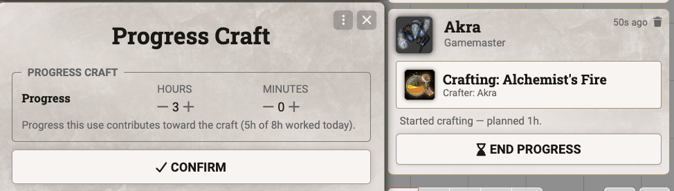
    </td>
  </tr>
</table>

---

## What's Next

- Non-item services: spellcasting, hirelings, food & lodging
- Search and filtering for the recipe browser
- Calender-based Restock (dnd5e 6.0.0)
